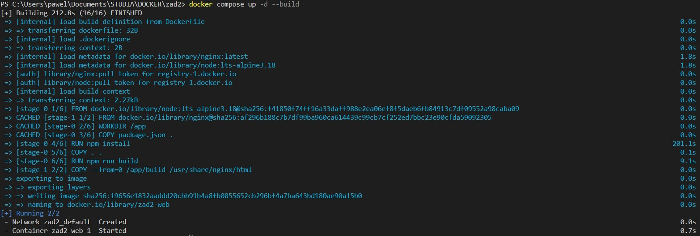
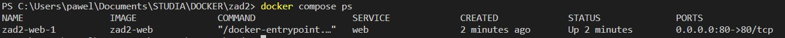
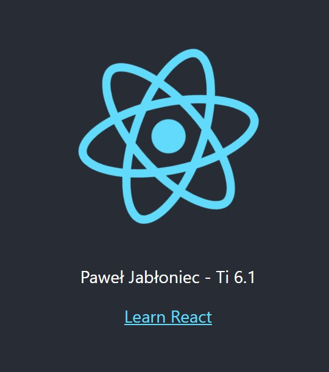
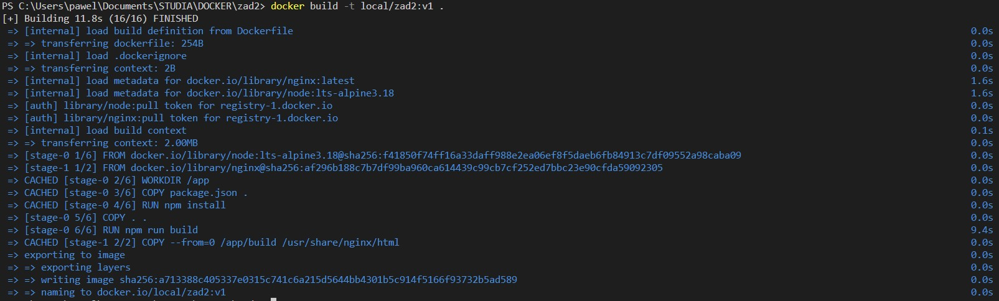
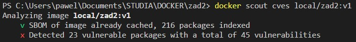
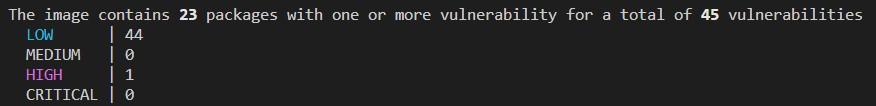

# Zadanie_2

Paweł Jabłoniec

Sprawozdanie - zadanie 2

---

### 1. Część podstawowa

#### 1. Modyfikacja kodu (imie i nazwisko studenta)

* Budowanie:

    `docker compose up -d --build`






* Strona po uruchomieniu:



#### 2. Zbudowanie obrazu i test CVE:
* Polecenie:
    `docker build -t local/zad2:v1`

    `docker scout cves local/zad2:v1`

* Efekt:







#### 3. Opracowanie łańcucha działań w ramach Github Actions:

```
name: gha_workflow:zadanie_2

on:
  workflow_dispatch:
  push:
    branches:
      - main

jobs:
  build:
    runs-on: ubuntu-latest
    
    steps:
      - name: Checkout this repo
        uses: actions/checkout@v3
        with:
          fetch-depth: 1
          submodules: true

      - name: Buildx set-up
        uses: docker/setup-buildx-action@v2
        
      - name: Docker Setup QEMU
        uses: docker/setup-qemu-action@v2

      - name: Login to GitHub Container Repository
        uses: docker/login-action@v1
        with:
          registry: ghcr.io
          username: ${{ github.repository_owner }}
          password: ${{ secrets.GHCR_TOKEN }}

      - name: Get current version
        id: get_version
        run: echo "::set-output name=version::v1.0.0"

      - name: Get current commit
        id: get_commit
        run: echo "::set-output name=commit::$(git rev-parse --short HEAD)"

      - name: Build and push
        uses: docker/build-push-action@v2
        with:
          platforms: linux/x86_64,linux/arm64/v8
          context: .
          file: ./Dockerfile
          push: true
          tags: |
            ghcr.io/${{ github.repository_owner }}/app:${{ steps.get_commit.outputs.commit }}
          cache-from: type=registry,ref=${{ github.repository_owner }}/app:${{ steps.get_version.outputs.version }}
          cache-to: type=inline

```

